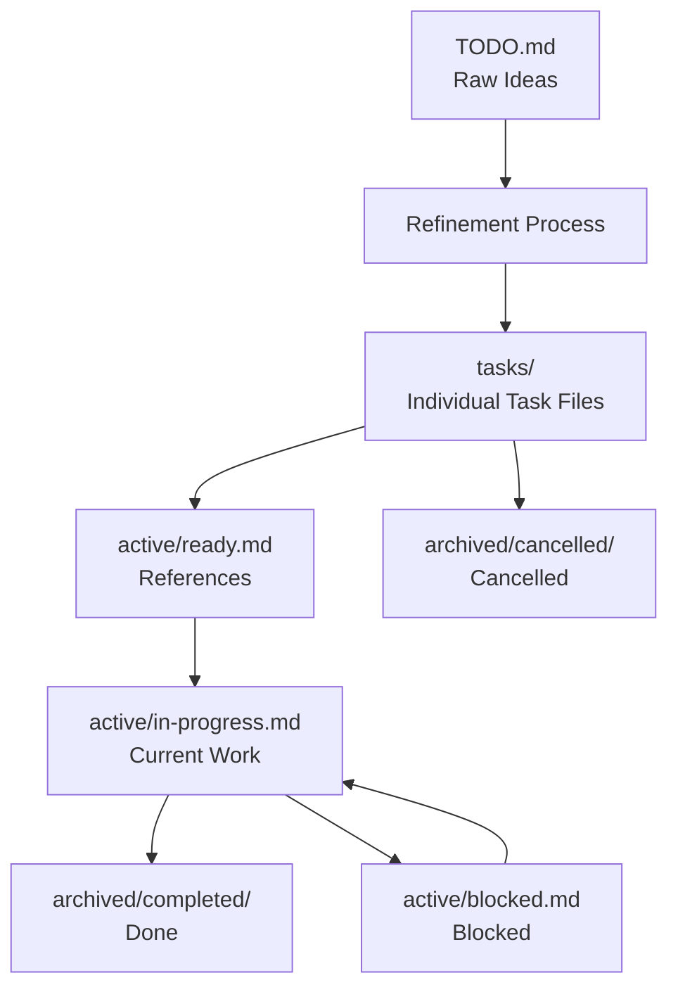

# Backlog Management

📋 **Structured backlog management system for AI-assisted task execution and project planning.**

This directory contains the backlog management structure designed to work seamlessly with AI agents for automated task execution and project coordination.

## 📁 Structure

```
backlog/
├── README.md                    # This file - backlog management guide
├── TODO.md                      # Raw notes and ideas for refinement
├── tasks/                       # Individual task files (refined tasks)
│   ├── README.md               # Task file management guide
│   ├── TASK-001-example-microservice-setup.md
│   ├── TASK-002-example-distributed-database.md
│   └── ...                     # Additional task files
├── active/                      # Current work tracking
│   ├── ready.md                # References to available tasks
│   ├── in-progress.md          # Current work (solo development)
│   └── blocked.md              # Blocked tasks (if any)
├── archived/                   # Completed and cancelled items
│   ├── README.md               # Archive management
│   ├── completed/              # Successfully completed task files
│   └── cancelled/              # Cancelled or obsolete task files
└── templates/                  # Task templates for consistency
    ├── task-template.md        # Comprehensive task template
    ├── task-template-simplified.md # Simplified template (recommended)
    └── bug-template.md         # Bug report template
```

## 🤖 AI Agent Integration

This backlog structure is designed for AI agents to:

1. **Parse and understand** task priorities and dependencies
2. **Execute tasks** by following structured templates
3. **Update status** across different backlog states
4. **Track progress** and maintain task history
5. **Generate reports** on backlog health and velocity

### AI Agent Usage Patterns

- **Task Pickup**: AI agents scan `active/ready.md` for available tasks by priority
- **Status Updates**: Update task files and move references between `ready.md` → `in-progress.md` → `archived/completed/`
- **Dependency Management**: Check `blocked.md` and task file dependencies
- **Progress Tracking**: Update individual task files with daily progress logs

## 📝 Task Lifecycle (Solo Development)



## 🏷️ Task States

| State | Location | Description |
|-------|----------|-------------|
| **Raw** | `TODO.md` | Unrefined ideas and notes |
| **Refined** | `tasks/TASK-XXX-*.md` | Detailed task files ready for work |
| **Ready** | `active/ready.md` | References to available tasks |
| **In Progress** | `active/in-progress.md` | Current work (solo development) |
| **Blocked** | `active/blocked.md` | Waiting on dependencies |
| **Completed** | `archived/completed/` | Successfully finished task files |
| **Cancelled** | `archived/cancelled/` | No longer needed task files |

## 🎯 Best Practices

### For Human Contributors
1. **Start with TODO.md** for quick idea capture
2. **Refine regularly** by creating detailed task files
3. **Use templates** for consistent task structure (see Template Selection below)
4. **Update status** when working on tasks
5. **Archive completed work** for historical reference

### For AI Agents
1. **Check dependencies** before starting tasks
2. **Follow templates** for consistent output
3. **Update status frequently** to maintain accuracy
4. **Link related tasks** for better context
5. **Generate summaries** of completed work

## 📝 Template Selection Guide

### When to Use Each Template

#### Simplified Template (Recommended for Solo Development)
**Use `templates/task-template-simplified.md` for:**
- Solo development and learning projects
- Distributed systems experiments
- Tasks under 3 days effort
- When you want to focus on implementation over planning
- AI-assisted development workflows

#### Comprehensive Template  
**Use `templates/task-template.md` for:**
- Complex enterprise projects
- Tasks requiring extensive stakeholder coordination
- High-risk or high-impact initiatives
- When detailed risk assessment is needed
- Multi-team coordination required

#### Bug Template
**Use `templates/bug-template.md` for:**
- Defect reporting and tracking
- Issues requiring detailed reproduction steps
- Problems affecting multiple users or systems

### Template Selection Quick Decision Tree
```
Is this a learning/solo project? → Yes → Use Simplified Template
Is this complex/high-risk? → Yes → Use Comprehensive Template  
Is this a bug/defect? → Yes → Use Bug Template
When in doubt → Use Simplified Template
```

## 🔗 Integration Points

- **User Stories**: Links to `../user-stories/` for context
- **Requirements**: References `../requirements/` for specifications
- **Workflows**: Connects to `../workflows/` for process alignment
- **Architecture**: May reference `../../architecture/` for technical context

## 📊 Metrics and Reporting

Track backlog health with these metrics:
- **Velocity**: Tasks completed per time period
- **Cycle Time**: Time from ready to completed
- **Blocked Ratio**: Percentage of tasks blocked
- **Priority Distribution**: Balance of high/medium/low priority items
- **Age Analysis**: How long tasks stay in each state

## 🚀 Getting Started (Solo Development)

1. **Capture ideas** in `TODO.md`
2. **Create detailed task file** in `tasks/` using simplified template (see Template Selection above)
3. **Add reference** to `active/ready.md`
4. **Start work** and update `active/in-progress.md`
5. **Track progress** in individual task file
6. **Archive completed** task file when done

### Example Workflow for Distributed Systems Learning
1. Add "implement load balancer" to `TODO.md`
2. Create `tasks/TASK-003-nginx-load-balancer.md` with detailed requirements
3. Reference it in `active/ready.md`
4. Move reference to `active/in-progress.md` when starting
5. Update task file daily with progress and learnings
6. Move completed file to `archived/completed/` when done
