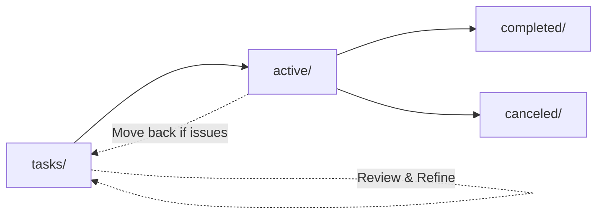

# Backlog Management

📋 **Simplified backlog management system for AI-assisted task execution.**

This directory contains a streamlined backlog structure designed for efficient AI agent task management and execution.

## 📁 Structure

```
backlog/
├── README.md                    # This file - AI agent instructions
├── TODO.md                      # Raw ideas and notes (HUMAN ONLY - DO NOT TOUCH)
├── tasks/                       # Tasks waiting for review and refinement
│   ├── TASK-001-example.md
│   ├── TASK-002-example.md
│   └── ...                      # Additional task files
├── active/                      # Tasks ready for execution
│   └── [task files moved here when ready]
├── completed/                   # Successfully completed tasks
│   └── [completed task files]
├── canceled/                    # Cancelled or obsolete tasks
│   └── [cancelled task files]
└── templates/                   # Task creation templates
    ├── task-template.md
    ├── task-template-simplified.md
    └── bug-template.md
```

## 🤖 AI Agent Instructions

### **CRITICAL RULES**
- ❌ **NEVER modify `TODO.md`** - This is human responsibility only
- ✅ **ALWAYS use task templates** from `templates/` when creating new tasks
- ✅ **Follow the task lifecycle** strictly as defined below
- ✅ **Update task status** by moving files between directories

### **Task Lifecycle for AI Agents**



#### **1. Task Review Phase (`tasks/` directory)**
- **Purpose**: Tasks waiting for review, refinement, or dependency resolution
- **AI Agent Actions**:
  - Review task requirements and dependencies
  - Refine task descriptions if needed
  - Check if prerequisites are met
  - Move to `active/` when ready for execution

#### **2. Execution Phase (`active/` directory)**
- **Purpose**: Tasks currently being worked on
- **AI Agent Actions**:
  - Execute the task according to specifications
  - Update task file with progress logs
  - Move to `completed/` when finished
  - Move to `canceled/` if task becomes obsolete

#### **3. Completion Phase (`completed/` directory)**
- **Purpose**: Successfully finished tasks
- **AI Agent Actions**:
  - Ensure all acceptance criteria are met
  - Update final status and completion date
  - Archive for future reference

#### **4. Cancellation Phase (`canceled/` directory)**
- **Purpose**: Tasks that are no longer needed
- **AI Agent Actions**:
  - Document reason for cancellation
  - Update task file with cancellation details
  - Archive for historical reference

### **AI Agent Workflow**

#### **Starting a New Task**
1. **Check `active/` directory** for current workload
2. **Select task from `tasks/`** based on priority and dependencies
3. **Review task file** thoroughly before starting
4. **Move task file** from `tasks/` to `active/`
5. **Begin execution** following task specifications

#### **During Task Execution**
1. **Update progress** in task file
2. **Document decisions** and technical approaches
3. **Track time spent** and any blockers encountered
4. **Update status** if task needs to move back to `tasks/`

#### **Completing a Task**
1. **Verify all acceptance criteria** are met
2. **Update task file** with final results and learnings
3. **Move task file** from `active/` to `completed/`
4. **Update any dependent tasks** if applicable

### **File Management Commands for AI Agents**

#### **Moving Tasks Between States**
```bash
# Move task from review to active
mv tasks/TASK-XXX-description.md active/

# Move task from active to completed
mv active/TASK-XXX-description.md completed/

# Move task from active to canceled
mv active/TASK-XXX-description.md canceled/

# Move task back to review (if issues found)
mv active/TASK-XXX-description.md tasks/
```

#### **Creating New Tasks**
1. **Read the `templates/README.md`** for detailed instructions on template usage and selection.
2. **Choose the appropriate template** from the `templates/` directory based on task type and complexity.
3. **Follow the naming convention**: `TASK-XXX-brief-description.md`
4. **Place the new task file** in the `tasks/` directory for review.
5. **Complete all required metadata and requirements** in the task file as specified in the template instructions.

### **Task File Standards**

#### **Required Sections**
- **Title**: Clear, descriptive task name
- **Priority**: High/Medium/Low based on business impact
- **Effort Estimate**: Time estimate in hours/days
- **Acceptance Criteria**: Specific, measurable completion criteria
- **Dependencies**: Any prerequisites or blocking tasks
- **Progress Log**: Daily updates during execution

#### **Naming Convention**
- Format: `TASK-XXX-brief-description.md`
- Example: `TASK-025-development-standards-guidelines-audit-update.md`
- Use descriptive names that clearly indicate task purpose

### **Priority Guidelines**

#### **High Priority**
- Critical system functionality
- Security vulnerabilities
- Production blocking issues
- High business impact features

#### **Medium Priority**
- Important enhancements
- Performance improvements
- Technical debt reduction
- User experience improvements

#### **Low Priority**
- Nice-to-have features
- Documentation updates
- Code cleanup
- Future planning items

### **Dependency Management**

#### **Before Starting a Task**
1. **Check task dependencies** in the task file
2. **Verify prerequisite tasks** are completed
3. **Ensure required resources** are available
4. **Move back to `tasks/`** if dependencies aren't met

#### **Blocking Other Tasks**
1. **Update dependent tasks** with current status
2. **Communicate blockers** clearly in task file
3. **Move dependent tasks** to `tasks/` if they're blocked

### **Progress Tracking**

#### **Daily Updates Required**
- **Date**: Current date and time
- **Time Spent**: Hours worked on task
- **Progress**: What was accomplished
- **Blockers**: Any issues encountered
- **Next Steps**: Plan for next session

#### **Example Progress Entry**
```markdown
## Progress Log

### 2025-08-27 16:23:00
- **Time Spent**: 4 hours
- **Progress**: Implemented core authentication logic, added unit tests
- **Blockers**: None
- **Next Steps**: Integrate with database layer, add integration tests
```

### **Quality Assurance**

#### **Before Marking Complete**
- [ ] All acceptance criteria met
- [ ] Code follows project standards
- [ ] Tests (if implemented) pass successfully
- [ ] Documentation updated
- [ ] No known issues remain

#### **Task File Validation**
- [ ] Proper template used
- [ ] All required sections filled
- [ ] Clear acceptance criteria
- [ ] Realistic effort estimates
- [ ] Dependencies identified

### **Error Handling**

#### **Common Issues and Solutions**
1. **Task file corrupted**: Restore from git history
2. **Missing dependencies**: Move task back to `tasks/` directory
3. **Scope creep**: Update task file and re-estimate effort
4. **Technical blockers**: Document issue and move to `tasks/` for review

---

## 🚀 Quick Start for AI Agents

1. **Check current workload** in `active/` directory
2. **Select next task** from `tasks/` directory
3. **Review requirements** thoroughly before starting
4. **Move to `active/`** when ready to begin
5. **Update progress** during execution
6. **Move to `completed/`** when finished
7. **Repeat** with next available task

## 📝 Important Notes

- **Human responsibility**: `TODO.md` is maintained by humans only
- **AI responsibility**: All task execution and status management
- **File movement**: Use git commands to move files between directories
- **Documentation**: Keep task files updated with current status
- **Quality**: Ensure high standards before marking tasks complete

---

**Remember**: This system is designed for efficiency and clarity. Follow the lifecycle strictly and maintain accurate status information for optimal project management.
