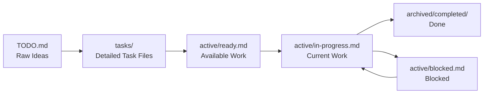

# Business Documentation

💼 **Business requirements, processes, and project management resources for effective product development and stakeholder alignment.**

This directory contains all business-related documentation that supports product development, requirement management, and project execution.

## 📁 Directory Structure

### 📋 Backlog Management
- **`backlog/`** – Streamlined backlog management system for solo development
  - `TODO.md` – Raw ideas and notes for refinement
  - `tasks/` – Individual detailed task files ready for work
  - `active/` – Current work tracking (ready, in-progress, blocked)
  - `archived/` – Completed and cancelled task files for reference
  - `templates/` – Task and bug templates for consistency

### 📋 Requirements Management
- **`requirements/functional/`** – Functional requirements and specifications
- **`requirements/non-functional/`** – Performance, security, and quality requirements

### 👥 User-Centered Design
- **`user-stories/`** – User stories and epics that drive development
- **`user-stories/epics/`** – Large-scale initiatives and feature themes

### 🔄 Business Processes
- **`workflows/`** – Business processes and operational workflows
- **`compliance/`** – Compliance requirements and documentation

## 🎯 Key Features

### AI-Assisted Backlog Management
The backlog management system is specifically designed for AI agents to:
- **Parse and execute tasks** using structured templates
- **Track progress** through defined workflow states
- **Manage dependencies** and blockers automatically
- **Generate reports** on velocity and completion metrics
- **Maintain historical records** for learning and improvement

### Structured Task Lifecycle (Solo Development)

### Template-Driven Consistency
- **Task Template**: Standard structure for distributed systems learning tasks
- **Task Template (Simplified)**: Streamlined version matching actual usage
- **Bug Template**: Issue reporting and tracking

## 🚀 Getting Started (Solo Development)

### Basic Workflow
1. **Capture ideas** in `backlog/TODO.md`
2. **Create detailed task** in `backlog/tasks/TASK-XXX-description.md`
3. **Add to ready queue** in `backlog/active/ready.md`
4. **Start work** and move to `backlog/active/in-progress.md`
5. **Track progress** in individual task file
6. **Complete** and move task file to `backlog/archived/completed/`

### For Distributed Systems Learning
1. **Focus on one task** at a time for deep learning
2. **Document learnings** and decisions in task files
3. **Build incrementally** from simple to complex systems
4. **Reference completed tasks** for future implementations
5. **Track skill progression** through archived work

### For AI Agent Assistance
1. **Use structured templates** for consistent task creation
2. **Maintain clear acceptance criteria** for automated validation
3. **Update progress regularly** for accurate tracking
4. **Document outcomes** for learning and reference

## 📊 Learning Progress Metrics

The system tracks key metrics for solo development:
- **Task Completion**: Tasks completed per week/month
- **Learning Velocity**: New distributed systems concepts mastered
- **Implementation Quality**: Successful deployments and functionality
- **Knowledge Retention**: Ability to reference and reuse past work
- **Skill Progression**: Complexity of tasks completed over time

## 🤖 AI Agent Integration

### Solo Development Assistance
- **Task creation**: Help refine TODO items into detailed task files
- **Progress tracking**: Monitor and update task status
- **Learning documentation**: Capture insights and decisions
- **Template compliance**: Ensure consistent task structure
- **Reference generation**: Link related concepts and implementations

### Automated Support
- **Task file creation**: Generate structured task files from TODO items
- **Progress monitoring**: Track completion and learning objectives
- **Knowledge linking**: Connect related distributed systems concepts
- **Documentation updates**: Maintain consistent documentation

## 🔗 Integration Points

### With Architecture Documentation
- **Technical requirements** link to `../architecture/decisions/`
- **System design** references `../architecture/diagrams/`
- **Technical debt** connects to architecture decisions

### With API Documentation
- **Integration requirements** reference `../api/specifications/openapi/`
- **API changes** tracked through backlog items

### With Development Process
- **Environment needs** connect to `../development/environments/`
- **Tool requirements** link to `../development/tools/`

## 📈 Success Metrics

### Project Delivery
- **On-time delivery**: Percentage of commitments met
- **Scope accuracy**: Planned vs actual feature delivery
- **Quality standards**: Defect rates and user satisfaction
- **Business value**: ROI and objective achievement

### Process Efficiency
- **Planning accuracy**: Estimate vs actual effort
- **Workflow efficiency**: Time in each state
- **Bottleneck identification**: Where work gets stuck
- **Continuous improvement**: Process optimization over time

## 💡 Best Practices

### Backlog Management
- **Regular refinement**: Keep backlog current and relevant
- **Clear priorities**: Maintain transparent prioritization criteria
- **Right-sized work**: Break large items into manageable tasks
- **Quality focus**: Don't compromise standards for speed

### Stakeholder Communication
- **Transparent reporting**: Regular updates on progress and metrics
- **Early feedback**: Involve stakeholders in requirement refinement
- **Clear expectations**: Document and communicate what "done" means
- **Value demonstration**: Show business impact of completed work

### Continuous Improvement
- **Retrospective analysis**: Learn from completed work
- **Process optimization**: Refine workflows based on data
- **Tool enhancement**: Improve templates and structures
- **Knowledge sharing**: Capture and share learnings

---

## 📚 Related Documentation

- **Architecture**: `../architecture/` for technical context
- **API Documentation**: `../api/` for integration details
- **Development**: `../development/` for implementation guidance
- **Runbooks**: `../runbooks/` for operational procedures
