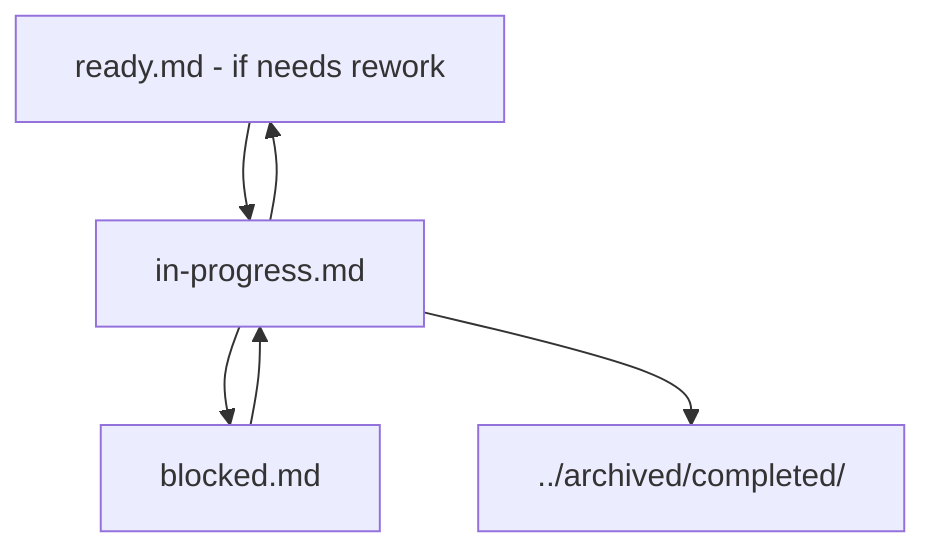

# In Progress Tasks

🚀 **Currently active task for solo development.**

> **Solo Focus**: Work on one task at a time for maximum focus and quality.

## 🔄 Current Work in Progress

*No tasks currently in progress.*

## 📝 How to Use (Solo Development)

When you start a task:
1. **Move task reference** from `ready.md` to here
2. **Update task file** status to "In Progress" and add start date
3. **Log daily progress** in the task file
4. **Move to completed** when done

### Example Format
```markdown
## Currently Working On
- **[TASK-001](../tasks/TASK-001-example-microservice-setup.md)** 
  - Started: 2024-01-15
  - Progress: 60% complete
  - Next: Configure API Gateway routing
```

---

## 📊 Progress Tracking

### Active Tasks Summary
- **Total In Progress**: 0
- **High Priority**: 0
- **Medium Priority**: 0
- **Low Priority**: 0
- **Average Age**: N/A
- **Blocked Count**: 0

### Team Allocation
- **Human Team Members**: 0 active tasks
- **AI Agents**: 0 active tasks

## 🤖 AI Agent Progress Format

When working on tasks, use this format:

```markdown
## [TASK-ID] Task Title

**Assignee**: AI Agent Name/ID
**Started**: YYYY-MM-DD HH:MM
**Priority**: High/Medium/Low
**Effort**: Estimated effort
**Progress**: X% Complete

### Current Status
Brief description of current progress and next steps.

### Completed Work
- [x] Completed item 1
- [x] Completed item 2
- [ ] In progress item
- [ ] Pending item

### Acceptance Criteria Progress
- [x] ✅ Criterion 1 - Completed
- [ ] 🔄 Criterion 2 - In Progress
- [ ] ⏳ Criterion 3 - Pending

### Recent Updates
- **2024-01-15 14:30**: Started implementation of core logic
- **2024-01-15 16:45**: Completed data model design
- **2024-01-16 09:15**: Working on API endpoints

### Blockers/Issues
- None currently (or list any issues encountered)

### Next Steps
1. Complete current implementation phase
2. Write unit tests
3. Integration testing

### Time Tracking
- **Time Spent**: 4.5 hours
- **Estimated Remaining**: 2 hours
```

## 🚨 Managing Blocked Tasks

If a task becomes blocked while in progress:

1. **Document the blocker** clearly
2. **Move to `blocked.md`** immediately
3. **Notify stakeholders** if needed
4. **Pick up next ready task** if capacity allows

## 📈 Progress Monitoring

### Daily Checks
- Review progress updates
- Identify tasks at risk
- Check for new blockers
- Update stakeholders on status

### Weekly Reviews
- Analyze cycle time trends
- Review WIP limit adherence
- Identify process improvements
- Update effort estimates based on actuals

## 🎯 Completion Criteria

Tasks are moved from in-progress when:

1. ✅ **All acceptance criteria** are met
2. 🧪 **Tests** are written and passing
3. 👀 **Code review** is completed (if applicable)
4. 📚 **Documentation** is updated
5. 🚀 **Deployment** is successful (if applicable)
6. ✅ **Stakeholder approval** is received

## 🔄 Task State Transitions



## 📋 Quick Actions

### For Team Members
- Update progress regularly
- Communicate blockers immediately
- Follow definition of done
- Collaborate on complex tasks

### For AI Agents
- Provide detailed progress updates
- Document decision rationale
- Link to relevant resources
- Maintain task traceability
