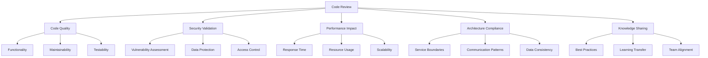
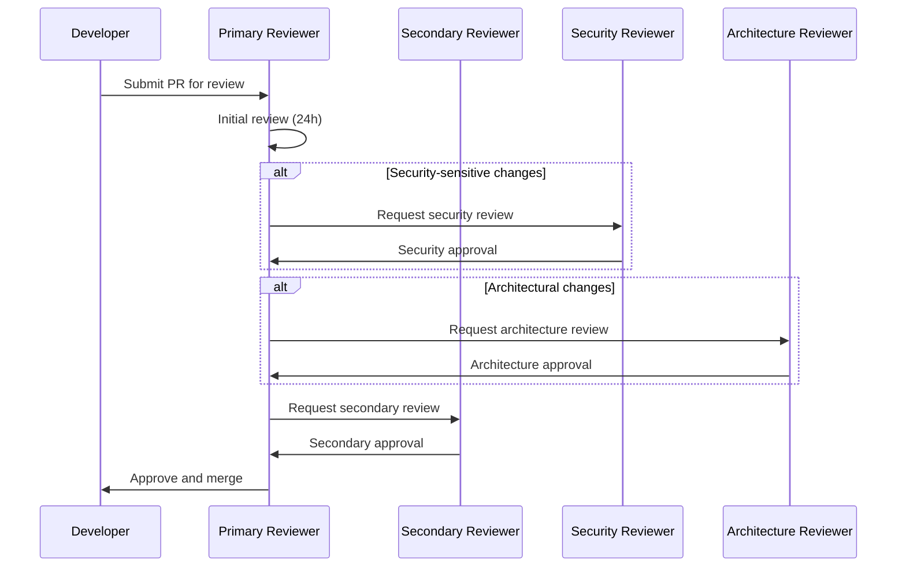
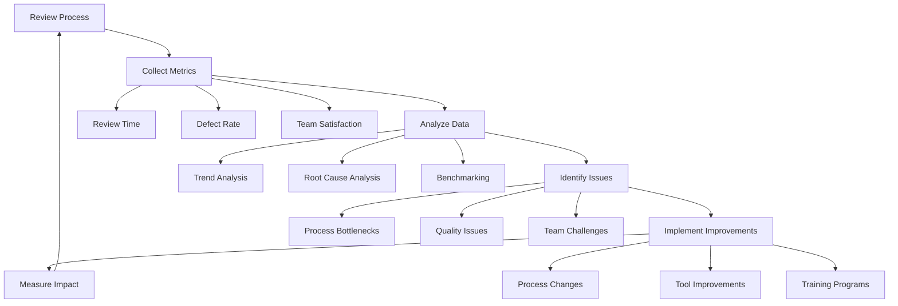

# Code Review Guidelines for Distributed Systems

## Table of Contents
1. [Overview & Core Principles](#overview--core-principles)
2. [Review Process & Workflow](#review-process--workflow)
3. [Distributed Systems Review Criteria](#distributed-systems-review-criteria)
4. [Security Review Checklist](#security-review-checklist)
5. [Performance Review Guidelines](#performance-review-guidelines)
6. [Architecture Review Process](#architecture-review-process)
7. [Review Automation & Tooling](#review-automation--tooling)
8. [Review Metrics & Quality Gates](#review-metrics--quality-gates)
9. [Review Process Optimization](#review-process-optimization)
10. [Implementation Guidelines](#implementation-guidelines)
11. [Best Practices Summary](#best-practices-summary)
12. [Validation Checklist](#validation-checklist)

## Overview & Core Principles

### **Philosophy**
Code reviews in distributed systems are not just about code quality—they are about **system reliability, security, and maintainability**. Every review should consider the impact on the entire distributed architecture, not just the individual service or component.

### **Core Principles**
- **System-Wide Impact**: Consider how changes affect the entire distributed system
- **Security by Design**: Security review is mandatory, not optional
- **Performance Awareness**: Understand performance implications across service boundaries
- **Observability Integration**: Ensure changes support monitoring and debugging
- **Consistency Maintenance**: Maintain architectural and coding consistency across services

### **Review Objectives**


### **Review Standards Hierarchy**
```
┌───────────────────────────────────────────────────────────┐
│                    REVIEW PRINCIPLES                      │
│              (Quality, Security, Performance)             │
├───────────────────────────────────────────────────────────┤
│              DISTRIBUTED SYSTEMS CRITERIA                 │
│         (Service Boundaries, Communication, Data)         │
├───────────────────────────────────────────────────────────┤
│               LANGUAGE-SPECIFIC REVIEWS                   │
│               (Go, Terraform, YAML, etc.)                 │
├───────────────────────────────────────────────────────────┤
│                AUTOMATION & TOOLING                       │
│             (Linters, Security Scanners, etc.)            │
└───────────────────────────────────────────────────────────┘
```

## Review Process & Workflow

### **Review Workflow**

#### **1. Pre-Review Preparation**
```yaml
# Pre-review checklist
pre_review:
  automated_checks:
    - linting_passed: true
    - unit_tests_passed: true
    - integration_tests_passed: true
    - security_scan_passed: true
    - performance_tests_passed: true
  
  documentation:
    - pr_description_complete: true
    - architecture_impact_documented: true
    - breaking_changes_identified: true
    - testing_strategy_documented: true
  
  readiness_criteria:
    - code_compiles: true
    - tests_pass: true
    - documentation_updated: true
    - adr_created_if_needed: true
```

#### **2. Review Assignment**
- **Primary Reviewer**: Domain expert for the service/component
- **Secondary Reviewer**: Cross-service impact reviewer
- **Security Reviewer**: For security-sensitive changes
- **Architecture Reviewer**: For architectural changes

#### **3. Review Process**


### **Review Timeline Standards**
- **Initial Review**: Within 24 hours
- **Security Review**: Within 48 hours
- **Architecture Review**: Within 72 hours
- **Final Approval**: Within 96 hours
- **Emergency Reviews**: Within 4 hours

### **Review Size Guidelines**
- **Small Changes**: < 200 lines (1 reviewer)
- **Medium Changes**: 200-500 lines (2 reviewers)
- **Large Changes**: > 500 lines (3+ reviewers + architecture review)
- **Refactoring**: Always requires architecture review

## Distributed Systems Review Criteria

### **Service Boundary Review**

#### **Service Design Validation**
```go
// ✅ GOOD: Clear service boundary
type OrderService struct {
    orderRepo    OrderRepository
    paymentSvc   PaymentServiceClient
    inventorySvc InventoryServiceClient
}

func (s *OrderService) CreateOrder(ctx context.Context, req *CreateOrderRequest) (*Order, error) {
    // Service only handles order creation logic
    // Delegates payment and inventory to other services
}

// ❌ BAD: Service boundary violation
type OrderService struct {
    db *sql.DB // Direct database access
}

func (s *OrderService) CreateOrder(ctx context.Context, req *CreateOrderRequest) (*Order, error) {
    // Directly handling payment processing
    // Should delegate to PaymentService
}
```

#### **Review Checklist**
- [ ] Service has single, well-defined responsibility
- [ ] No direct database access outside service boundary
- [ ] Service communicates through well-defined interfaces
- [ ] No business logic duplication across services
- [ ] Service can be deployed independently

### **Communication Pattern Review**

#### **Service-to-Service Communication**
```go
// ✅ GOOD: Proper service communication
func (s *OrderService) ProcessPayment(ctx context.Context, orderID string, amount decimal.Decimal) error {
    // Create proper context with tracing
    ctx = trace.ContextWithSpan(ctx, span)
    
    // Add timeout and retry logic
    ctx, cancel := context.WithTimeout(ctx, 30*time.Second)
    defer cancel()
    
    // Use circuit breaker pattern
    return s.paymentClient.ProcessPayment(ctx, &PaymentRequest{
        OrderID: orderID,
        Amount:  amount,
    })
}

// ❌ BAD: Poor service communication
func (s *OrderService) ProcessPayment(orderID string, amount decimal.Decimal) error {
    // No context propagation
    // No timeout handling
    // No error handling
    return s.paymentClient.ProcessPayment(&PaymentRequest{
        OrderID: orderID,
        Amount:  amount,
    })
}
```

#### **Review Checklist**
- [ ] Proper context propagation with tracing
- [ ] Timeout handling for external calls
- [ ] Circuit breaker pattern implementation
- [ ] Retry logic with exponential backoff
- [ ] Error handling and propagation
- [ ] Request/response logging

### **Data Consistency Review**

#### **Distributed Transaction Handling**
```go
// ✅ GOOD: Saga pattern implementation
func (s *OrderService) CreateOrderWithSaga(ctx context.Context, req *CreateOrderRequest) (*Order, error) {
    saga := &CreateOrderSaga{
        orderService: s,
        steps: []SagaStep{
            {Name: "reserve_inventory", Compensate: "release_inventory"},
            {Name: "process_payment", Compensate: "refund_payment"},
            {Name: "create_order", Compensate: "cancel_order"},
        },
    }
    
    return saga.Execute(ctx, req)
}

// ❌ BAD: No distributed transaction handling
func (s *OrderService) CreateOrder(ctx context.Context, req *CreateOrderRequest) (*Order, error) {
    // No transaction management
    // No compensation logic
    // No rollback handling
}
```

#### **Review Checklist**
- [ ] Distributed transaction patterns implemented (Saga, 2PC)
- [ ] Compensation logic for rollback scenarios
- [ ] Event sourcing for audit trails
- [ ] Data consistency model clearly defined
- [ ] Conflict resolution strategies implemented

### **Observability Integration Review**

#### **Logging and Metrics**
```go
// ✅ GOOD: Comprehensive observability
func (s *OrderService) CreateOrder(ctx context.Context, req *CreateOrderRequest) (*Order, error) {
    // Start span for tracing
    span, ctx := opentracing.StartSpanFromContext(ctx, "order.create")
    defer span.Finish()
    
    // Add structured logging
    logger := log.WithContext(ctx).WithFields(log.Fields{
        "service": "order-service",
        "operation": "create_order",
        "user_id": req.UserID,
    })
    
    // Record metrics
    start := time.Now()
    defer func() {
        s.metrics.OrderCreationDuration.Observe(time.Since(start).Seconds())
    }()
    
    logger.Info("Creating order")
    
    order, err := s.createOrder(ctx, req)
    if err != nil {
        logger.WithError(err).Error("Failed to create order")
        s.metrics.OrderCreationErrors.Inc()
        return nil, err
    }
    
    logger.WithField("order_id", order.ID).Info("Order created successfully")
    s.metrics.OrderCreations.Inc()
    
    return order, nil
}
```

#### **Review Checklist**
- [ ] Distributed tracing implemented
- [ ] Structured logging with context
- [ ] Business and technical metrics recorded
- [ ] Error tracking and alerting
- [ ] Performance monitoring integrated

## Security Review Checklist

### **Authentication & Authorization**

#### **Access Control Validation**
```go
// ✅ GOOD: Proper authorization
func (s *OrderService) GetOrder(ctx context.Context, orderID string) (*Order, error) {
    // Extract user from context
    user, err := auth.UserFromContext(ctx)
    if err != nil {
        return nil, errors.New("unauthorized")
    }
    
    // Check permissions
    if !user.HasPermission("order:read") {
        return nil, errors.New("insufficient permissions")
    }
    
    // Validate resource ownership
    order, err := s.orderRepo.GetByID(ctx, orderID)
    if err != nil {
        return nil, err
    }
    
    if order.UserID != user.ID {
        return nil, errors.New("access denied")
    }
    
    return order, nil
}
```

#### **Security Review Checklist**
- [ ] Authentication required for all endpoints
- [ ] Authorization checks implemented
- [ ] Resource ownership validation
- [ ] Input validation and sanitization
- [ ] SQL injection prevention
- [ ] XSS prevention
- [ ] CSRF protection
- [ ] Rate limiting implemented
- [ ] Sensitive data encryption
- [ ] Audit logging for security events

### **Data Protection**

#### **Sensitive Data Handling**
```go
// ✅ GOOD: Proper data protection
type Order struct {
    ID          string    `json:"id"`
    UserID      string    `json:"user_id"`
    Amount      decimal.Decimal `json:"amount"`
    Status      string    `json:"status"`
    CreatedAt   time.Time `json:"created_at"`
    
    // Sensitive data encrypted
    PaymentInfo *EncryptedPaymentInfo `json:"payment_info,omitempty"`
    ShippingAddress *EncryptedAddress `json:"shipping_address,omitempty"`
}

// ❌ BAD: Exposed sensitive data
type Order struct {
    ID          string    `json:"id"`
    UserID      string    `json:"user_id"`
    Amount      decimal.Decimal `json:"amount"`
    Status      string    `json:"status"`
    CreatedAt   time.Time `json:"created_at"`
    
    // Sensitive data exposed
    CreditCard  string    `json:"credit_card"`
    CVV         string    `json:"cvv"`
    Address     string    `json:"address"`
}
```

#### **Data Protection Checklist**
- [ ] PII data identified and protected
- [ ] Encryption at rest and in transit
- [ ] Data masking for logs
- [ ] Secure data disposal
- [ ] Data retention policies followed
- [ ] GDPR compliance considerations
- [ ] PCI DSS compliance for payment data

## Performance Review Guidelines

### **Performance Impact Assessment**

#### **Response Time Analysis**
```go
// ✅ GOOD: Performance-aware implementation
func (s *OrderService) GetOrders(ctx context.Context, userID string, limit int) ([]*Order, error) {
    // Add performance monitoring
    start := time.Now()
    defer func() {
        s.metrics.QueryDuration.Observe(time.Since(start).Seconds())
    }()
    
    // Implement pagination
    if limit > 100 {
        limit = 100 // Prevent large queries
    }
    
    // Use efficient query with proper indexing
    orders, err := s.orderRepo.GetByUserID(ctx, userID, limit)
    if err != nil {
        return nil, err
    }
    
    // Cache frequently accessed data
    s.cache.Set(fmt.Sprintf("user_orders:%s", userID), orders, 5*time.Minute)
    
    return orders, nil
}
```

#### **Performance Review Checklist**
- [ ] Response time targets met (< 200ms for APIs)
- [ ] Database queries optimized
- [ ] Caching strategy implemented
- [ ] Resource usage within limits
- [ ] Memory leaks prevented
- [ ] Connection pooling configured
- [ ] Async processing where appropriate
- [ ] Load testing completed

### **Scalability Considerations**

#### **Horizontal Scaling Support**
```go
// ✅ GOOD: Stateless service design
type OrderService struct {
    orderRepo    OrderRepository
    paymentSvc   PaymentServiceClient
    inventorySvc InventoryServiceClient
    cache        Cache
    metrics      Metrics
}

func (s *OrderService) CreateOrder(ctx context.Context, req *CreateOrderRequest) (*Order, error) {
    // No local state - can scale horizontally
    // All state stored in external systems
    // Stateless processing
}
```

#### **Scalability Review Checklist**
- [ ] Service is stateless
- [ ] No local file system dependencies
- [ ] Database connections pooled
- [ ] Caching strategy supports scaling
- [ ] Load balancing compatible
- [ ] Auto-scaling configuration ready

## Architecture Review Process

### **Architecture Compliance Review**

#### **ADR Compliance Check**
```yaml
# Architecture review checklist
architecture_review:
  adr_compliance:
    - adr_001_user_management: "Compliant"
    - adr_002_order_processing: "Compliant"
    - adr_003_container_orchestration: "Compliant"
    - adr_004_data_storage: "Compliant"
    - adr_005_message_queues: "Compliant"
  
  design_patterns:
    - service_boundaries: "Clear and well-defined"
    - communication_patterns: "Event-driven and REST"
    - data_consistency: "Eventual consistency with sagas"
    - error_handling: "Circuit breakers and retries"
    - observability: "Distributed tracing and metrics"
  
  technology_stack:
    - programming_language: "Go 1.21+"
    - database: "PostgreSQL with Redis caching"
    - message_queue: "Apache Kafka"
    - container_orchestration: "Kubernetes with Istio"
    - monitoring: "Prometheus + Grafana + Jaeger"
```

### **Service Design Review**

#### **Microservices Principles**
- [ ] Single responsibility principle followed
- [ ] Service boundaries clearly defined
- [ ] Loose coupling maintained
- [ ] High cohesion within service
- [ ] Independent deployability
- [ ] Technology diversity supported
- [ ] Failure isolation implemented

### **Integration Pattern Review**

#### **Service Communication**
- [ ] Synchronous communication minimized
- [ ] Asynchronous patterns preferred
- [ ] Event-driven architecture implemented
- [ ] API versioning strategy followed
- [ ] Backward compatibility maintained
- [ ] Circuit breaker pattern implemented
- [ ] Retry logic with exponential backoff

## Review Automation & Tooling

### **Automated Review Tools**

#### **Code Quality Tools**
```yaml
# Automated review configuration
automated_review:
  linting:
    - tool: "golangci-lint"
      config: ".golangci.yml"
      checks: ["gofmt", "govet", "golint", "ineffassign", "misspell"]
    
    - tool: "gosec"
      config: ".gosec.yml"
      checks: ["security", "vulnerabilities"]
  
  testing:
    - tool: "go test"
      coverage_threshold: 80%
      race_detection: true
    
    - tool: "ginkgo"
      integration_tests: true
      performance_tests: true
  
  security:
    - tool: "trivy"
      vulnerability_scan: true
      license_check: true
    
    - tool: "semgrep"
      security_rules: "security"
      custom_rules: ".semgrep.yml"
  
  performance:
    - tool: "pprof"
      memory_profiling: true
      cpu_profiling: true
    
    - tool: "k6"
      load_testing: true
      performance_thresholds: true
```

### **Review Automation Workflow**

#### **CI/CD Integration**
```yaml
# GitHub Actions workflow for automated review
name: Code Review Automation

on:
  pull_request:
    types: [opened, synchronize, reopened]

jobs:
  automated-review:
    runs-on: ubuntu-latest
    steps:
      - name: Checkout code
        uses: actions/checkout@v3
      
      - name: Run linting
        run: |
          golangci-lint run
          gosec ./...
      
      - name: Run tests
        run: |
          go test -race -coverprofile=coverage.out ./...
          go tool cover -html=coverage.out -o coverage.html
      
      - name: Security scan
        run: |
          trivy fs .
          semgrep --config=security .
      
      - name: Performance test
        run: |
          k6 run performance-tests.js
      
      - name: Generate review report
        run: |
          ./scripts/generate-review-report.sh
      
      - name: Comment on PR
        uses: actions/github-script@v6
        with: |
          script: |
            const fs = require('fs');
            const report = fs.readFileSync('review-report.md', 'utf8');
            github.rest.issues.createComment({
              issue_number: context.issue.number,
              owner: context.repo.owner,
              repo: context.repo.repo,
              body: report
            });
```

### **Review Tool Configuration**

#### **Linting Configuration**
```yaml
# .golangci.yml
run:
  timeout: 5m
  issues-exit-code: 1
  tests: true
  modules-download-mode: readonly

linters-settings:
  gocyclo:
    min-complexity: 15
  goconst:
    min-len: 2
    min-occurrences: 2
  gocritic:
    enabled-tags:
      - diagnostic
      - experimental
      - opinionated
      - performance
      - style
  govet:
    check-shadowing: true
  misspell:
    locale: US
  nolintlint:
    allow-leading-space: true
    allow-unused: false
    require-explanation: false
    require-specific: false

linters:
  enable:
    - bodyclose
    - dogsled
    - dupl
    - errcheck
    - exportloopref
    - gochecknoinits
    - goconst
    - gocritic
    - gocyclo
    - gofmt
    - goimports
    - golint
    - gomnd
    - goprintffuncname
    - gosec
    - gosimple
    - govet
    - ineffassign
    - misspell
    - nakedret
    - noctx
    - nolintlint
    - rowserrcheck
    - staticcheck
    - structcheck
    - stylecheck
    - typecheck
    - unconvert
    - unparam
    - unused
    - varcheck
    - whitespace

issues:
  exclude-rules:
    - path: _test\.go
      linters:
        - gomnd
        - goconst
        - dupl
```

## Review Metrics & Quality Gates

### **Review Quality Metrics**

#### **Code Quality Metrics**
```yaml
# Quality gate configuration
quality_gates:
  code_quality:
    test_coverage: 80%
    cyclomatic_complexity: 15
    code_duplication: 3%
    maintainability_index: 70
    technical_debt_ratio: 5%
  
  security:
    vulnerability_count: 0
    security_hotspots: 0
    code_smells_security: 0
    dependency_vulnerabilities: 0
  
  performance:
    response_time_p95: 200ms
    memory_usage: 512MB
    cpu_usage: 70%
    database_query_time: 100ms
  
  architecture:
    adr_compliance: 100%
    service_boundary_violations: 0
    coupling_metrics: "Low"
    cohesion_metrics: "High"
```

### **Review Process Metrics**

#### **Review Efficiency Metrics**
- **Review Turnaround Time**: < 24 hours for initial review
- **Review Cycle Time**: < 96 hours for complete review
- **Review Coverage**: 100% of code changes reviewed
- **Review Quality Score**: > 8/10 average rating
- **Defect Detection Rate**: > 90% of issues caught in review

#### **Review Effectiveness Metrics**
- **Post-Review Defects**: < 5% of issues found post-deployment
- **Review Comment Resolution**: 100% of comments addressed
- **Knowledge Transfer**: > 80% of team members understand changes
- **Architecture Compliance**: 100% compliance with ADRs

### **Quality Gate Implementation**

#### **Automated Quality Gates**
```go
// Quality gate validation
type QualityGate struct {
    CodeQuality    CodeQualityMetrics
    Security       SecurityMetrics
    Performance    PerformanceMetrics
    Architecture   ArchitectureMetrics
}

func (qg *QualityGate) Validate(pr *PullRequest) error {
    var errors []string
    
    // Code quality checks
    if pr.Coverage < 0.8 {
        errors = append(errors, "Test coverage below 80%")
    }
    
    if pr.Complexity > 15 {
        errors = append(errors, "Cyclomatic complexity too high")
    }
    
    // Security checks
    if len(pr.Vulnerabilities) > 0 {
        errors = append(errors, "Security vulnerabilities found")
    }
    
    // Performance checks
    if pr.ResponseTime > 200*time.Millisecond {
        errors = append(errors, "Response time exceeds 200ms")
    }
    
    // Architecture checks
    if !pr.ADRCompliant {
        errors = append(errors, "Not compliant with ADRs")
    }
    
    if len(errors) > 0 {
        return fmt.Errorf("Quality gate failed: %s", strings.Join(errors, ", "))
    }
    
    return nil
}
```

## Review Process Optimization

### **Review Process Improvement**

#### **Continuous Improvement Framework**


### **Review Process Optimization Strategies**

#### **1. Review Load Balancing**
- **Expertise-Based Assignment**: Match reviewers with domain expertise
- **Workload Distribution**: Balance review load across team members
- **Reviewer Rotation**: Rotate reviewers to prevent bottlenecks
- **Emergency Review Process**: Fast-track process for critical fixes

#### **2. Review Quality Improvement**
- **Reviewer Training**: Regular training on review best practices
- **Review Templates**: Standardized review checklists
- **Review Guidelines**: Clear guidelines for different types of changes
- **Review Feedback**: Regular feedback on review quality

#### **3. Review Efficiency Enhancement**
- **Automated Checks**: Maximize automated review coverage
- **Review Tools**: Use tools to improve review efficiency
- **Review Templates**: Pre-filled templates for common scenarios
- **Review Scheduling**: Optimize review scheduling and timing

### **Review Process Metrics Dashboard**

#### **Key Performance Indicators**
```yaml
# Review process KPIs
review_kpis:
  efficiency:
    - name: "Review Turnaround Time"
      target: "< 24 hours"
      current: "18 hours"
      trend: "improving"
    
    - name: "Review Cycle Time"
      target: "< 96 hours"
      current: "72 hours"
      trend: "stable"
    
    - name: "Review Coverage"
      target: "100%"
      current: "98%"
      trend: "improving"
  
  quality:
    - name: "Defect Detection Rate"
      target: "> 90%"
      current: "92%"
      trend: "stable"
    
    - name: "Post-Review Defects"
      target: "< 5%"
      current: "3%"
      trend: "improving"
    
    - name: "Architecture Compliance"
      target: "100%"
      current: "100%"
      trend: "stable"
  
  team_satisfaction:
    - name: "Reviewer Satisfaction"
      target: "> 8/10"
      current: "8.5/10"
      trend: "stable"
    
    - name: "Developer Satisfaction"
      target: "> 8/10"
      current: "8.2/10"
      trend: "improving"
```

## Implementation Guidelines

### **Review Process Implementation**

#### **Phase 1: Foundation Setup**
1. **Tool Configuration**
   - Set up automated linting and testing
   - Configure security scanning tools
   - Implement performance testing
   - Set up review automation

2. **Process Definition**
   - Define review workflow
   - Create review checklists
   - Establish review timelines
   - Set up review metrics

3. **Team Training**
   - Train reviewers on distributed systems concepts
   - Provide security review training
   - Conduct performance review workshops
   - Share architecture review guidelines

#### **Phase 2: Process Optimization**
1. **Metrics Collection**
   - Implement review metrics tracking
   - Set up quality gate monitoring
   - Create review dashboards
   - Establish reporting processes

2. **Continuous Improvement**
   - Regular process reviews
   - Feedback collection and analysis
   - Process optimization implementation
   - Tool and workflow improvements

#### **Phase 3: Advanced Features**
1. **AI-Assisted Reviews**
   - Implement AI-powered code analysis
   - Use machine learning for defect prediction
   - Automate routine review tasks
   - Enhance review quality with AI insights

2. **Advanced Analytics**
   - Predictive analytics for review outcomes
   - Risk assessment for code changes
   - Performance impact prediction
   - Security risk analysis

### **Review Process Integration**

#### **Development Workflow Integration**
```yaml
# Integration with development workflow
workflow_integration:
  git_workflow:
    - feature_branches: "All changes in feature branches"
    - pull_requests: "All changes via pull requests"
    - review_required: "All PRs require review"
    - merge_after_approval: "Merge only after approval"
  
  ci_cd_integration:
    - automated_tests: "Run on every PR"
    - quality_gates: "Block merge if gates fail"
    - security_scan: "Scan on every PR"
    - performance_test: "Test on every PR"
  
  monitoring_integration:
    - review_metrics: "Track review performance"
    - quality_metrics: "Monitor code quality"
    - team_metrics: "Track team performance"
    - system_metrics: "Monitor system health"
```

## Best Practices Summary

### **Review Best Practices**

#### **For Reviewers**
1. **Focus on High-Impact Areas**
   - Security vulnerabilities
   - Performance bottlenecks
   - Architecture violations
   - Business logic errors

2. **Provide Constructive Feedback**
   - Be specific and actionable
   - Explain the "why" behind suggestions
   - Offer alternatives when possible
   - Balance criticism with praise

3. **Consider System Impact**
   - Think beyond the immediate change
   - Consider downstream effects
   - Evaluate scalability implications
   - Assess maintainability impact

#### **For Developers**
1. **Prepare for Review**
   - Write clear commit messages
   - Provide comprehensive PR descriptions
   - Include relevant documentation
   - Add tests for new functionality

2. **Respond to Feedback**
   - Address all review comments
   - Ask questions when unclear
   - Provide context when needed
   - Learn from feedback

3. **Maintain Quality**
   - Follow coding standards
   - Write comprehensive tests
   - Consider security implications
   - Think about performance impact

### **Distributed Systems Review Best Practices**

#### **Service Design Review**
- **Single Responsibility**: Each service has one clear purpose
- **Loose Coupling**: Services communicate through well-defined interfaces
- **High Cohesion**: Related functionality grouped together
- **Independent Deployability**: Services can be deployed independently

#### **Communication Review**
- **Context Propagation**: Proper context handling across services
- **Error Handling**: Comprehensive error handling and propagation
- **Timeout Management**: Appropriate timeout configuration
- **Circuit Breakers**: Circuit breaker pattern implementation

#### **Data Management Review**
- **Consistency Models**: Appropriate consistency model selection
- **Transaction Management**: Proper distributed transaction handling
- **Data Partitioning**: Effective data partitioning strategies
- **Caching Strategy**: Appropriate caching implementation

## Validation Checklist

### **Review Process Validation**

#### **Process Completeness**
- [ ] Review workflow defined and documented
- [ ] Review timelines established
- [ ] Review assignment process defined
- [ ] Review escalation process documented
- [ ] Review metrics collection implemented

#### **Tool Integration**
- [ ] Automated linting configured
- [ ] Security scanning integrated
- [ ] Performance testing automated
- [ ] Quality gates implemented
- [ ] Review automation working

#### **Team Readiness**
- [ ] Reviewers trained on distributed systems
- [ ] Security review training completed
- [ ] Performance review training completed
- [ ] Architecture review training completed
- [ ] Review process training completed

### **Review Quality Validation**

#### **Code Quality**
- [ ] Test coverage > 80%
- [ ] Cyclomatic complexity < 15
- [ ] Code duplication < 3%
- [ ] Security vulnerabilities = 0
- [ ] Performance targets met

#### **Architecture Compliance**
- [ ] ADR compliance = 100%
- [ ] Service boundaries respected
- [ ] Communication patterns followed
- [ ] Data consistency models implemented
- [ ] Observability integrated

#### **Documentation Quality**
- [ ] Code documentation complete
- [ ] API documentation updated
- [ ] Architecture documentation current
- [ ] Runbook documentation updated
- [ ] Change documentation complete

### **Review Effectiveness Validation**

#### **Process Effectiveness**
- [ ] Review turnaround time < 24 hours
- [ ] Review cycle time < 96 hours
- [ ] Defect detection rate > 90%
- [ ] Post-review defects < 5%
- [ ] Team satisfaction > 8/10

#### **Quality Improvement**
- [ ] Code quality trends improving
- [ ] Security posture strengthening
- [ ] Performance metrics stable
- [ ] Architecture compliance maintained
- [ ] Knowledge transfer effective

---

## Related Documentation

### **Project Standards**
- [Coding Standards](coding-standards.md) - Comprehensive coding standards
- [Testing Guidelines](testing-guidelines.md) - Testing strategies and practices
- [Security Best Practices](security-best-practices.md) - Security guidelines
- [Performance Standards](performance-standards.md) - Performance optimization
- [Documentation Standards](documentation-standards.md) - Documentation practices

### **Architecture Documentation**
- [Architecture Decision Records](../../architecture/decisions/) - ADR compliance
- [System Overview](../../architecture/overview/system-overview.md) - System architecture
- [Distributed Patterns](../../architecture/patterns/distributed-patterns.md) - Design patterns

### **API Documentation**
- [API Design Principles](../../api/guides/api-design-principles.md) - API design standards
- [Authorization Guidelines](../../api/guides/authorization.md) - Security patterns
- [Rate Limiting](../../api/guides/rate-limiting.md) - Performance patterns

---

**Document Version**: 1.0  
**Last Updated**: 2025-09-05
